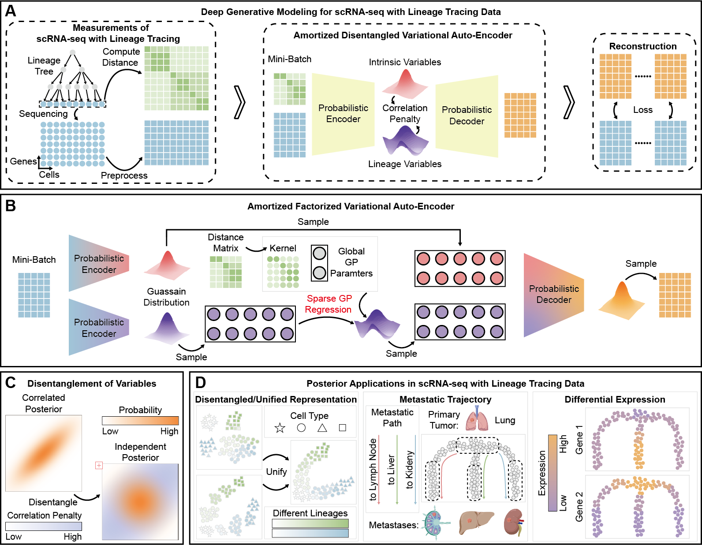

# DeepTracing - Decoupling Lineage and Intrinsic Information in Single-Cell Lineage Tracing Data with Deep Disentangled Representation Learning

`DeepTracing` is a PyTorch-based package for disentangling and integrating lineage and cell-state information from single-cell lineage-tracing data.

---

## Introduction


Overview of the DeepTracing model. 
(A) The overall architecture of DeepTracing, which illustrates the computational flow from the input of scRNA-seq and lineage tracing data, through the encoder, the layered latent space, and reconstruction via the decoder. 
(B) The structural design of the DeepTracing latent space, showing the factorization of the latent space into the intrinsic state embedding and the lineage embedding, along with their distinct prior constraints. 
(C) A schematic representation of the decoupling mechanism, comparing the changes in correlation of the posterior distributions of the latent variables before and after applying the TC penalty constraint. 
(D) The disentangled/unified representations generated by the model and their downstream biological applications.

---

## Installation and Usage

**1. Clone this repository**

```bash
git clone https://github.com/Yuhong/DeepTracing.git
cd DeepTracing
```

The main source code is located in the `src/` directory.

**2. Create the conda environment**

This project provides an `environment.yml` file in the repository root, which specifies all required dependencies.

Create the environment with:

```bash
conda env create -f environment.yml
```

This will create a conda environment named `DeepTracing`.

**3. Activate the environment**

```bash
conda activate DeepTracing
```

**4. Run the code**

After activating the environment, you can run the code in the `example/` and `experiments/` directories, for example:

```bash
cd example
python run_DeepTracing_TedSim.py
```
